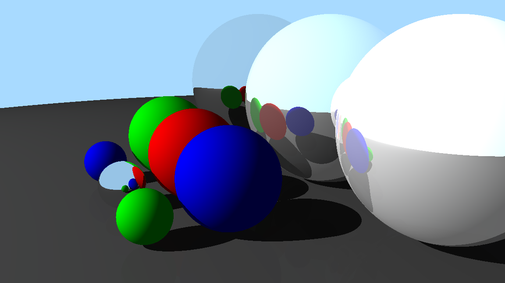

# Rays

I wanted to improved my JS and learn raytracing. 
So I built a dynamic realtime raytracer in pure JavaScript with no libraries.

## Live demo

Try the live demo in your browser (best on desktop): [gianluca-rays.vercel.app](https://gianluca-rays.vercel.app/)

## Example scene

 

## Features

- Realtime rendering: 75fps for 192 x 108 resolution.
- High-res rendering: ~700ms for 1152 x 647 resolution.
- Use the mouse and keyboard to reposition and angle the camera.
- Supports:
    - Multiple light sources
    - Spherical objects
    - Multiple light interaction types:
        - Lambertian / diffusion reflection
        - Specular reflection (mirrors)
        - Ambient lighting
        - Shadows

---

## Installation

- Clone / download repo and `cd` into the directory.
- Serve the directory with `npx serve .` or `python -m http.server`.
- Head to `localhost:3000` or `localhost:8000` (or whatever port you configured your server to use).

---

I adapted core techniques from these great resources:

- [RayTracingInOneWeekend](https://raytracing.github.io/books/RayTracingInOneWeekend.html)
- [https://tmcw.github.io/literate-raytracer](https://tmcw.github.io/literate-raytracer/)
